# Высокодоступный стенд NetBox, Ceph, Patroni, Redis, VictoriaMetrics, ElasticSearch, Kibana и Grafana

## Задание

Необходимо развернуть NetBox с кластеризацией и балансировкой веб-сервера и СУБД.

В итоге в проект должны быть включены:

- как минимум 2 узла с СУБД;
- минимум 2 узла с веб-серверами;
- центральный сервер сбора логов;
- мониторинг.

## Реализация

Задание сделано так, чтобы его можно было запустить как в **Vagrant**, так и в **Yandex Cloud**. После запуска происходит развёртывание следующих виртуальных машин (всего 12):

- **netbox-core-01** - **ceph (osd, mon, mgr, rgw)**, **etcd**, **redis sentinel**;
- **netbox-core-02** - **ceph (osd, mon, mgr, rgw)**, **etcd**, **redis sentinel**;
- **netbox-core-03** - **ceph (osd, mon, mgr, rgw)**, **etcd**, **redis sentinel**;
- **netbox-db-01** - **patroni**, **redis**;
- **netbox-db-02** - **patroni**, **redis**;
- **netbox-web-01** - **angie**, **haproxy**, **keepalived**, **netbox**, **pgbouncer**;
- **netbox-web-02** - **angie**, **haproxy**, **keepalived**, **netbox**, **pgbouncer**;
- **netbox-logs-01** - **alertmanager**, **elasticsearch**, **haproxy**, **victoriametrics**;
- **netbox-logs-02** - **alertmanager**, **elasticsearch**, **haproxy**, **victoriametrics**;
- **netbox-logs-03** - **alertmanager**, **elasticsearch**, **haproxy**, **victoriametrics**;
- **netbox-ui-01** - **haproxy**, **grafana**, **kibana**, **pgbouncer**;
- **netbox-ui-02** - **haproxy**, **grafana**, **kibana**, **pgbounder**.

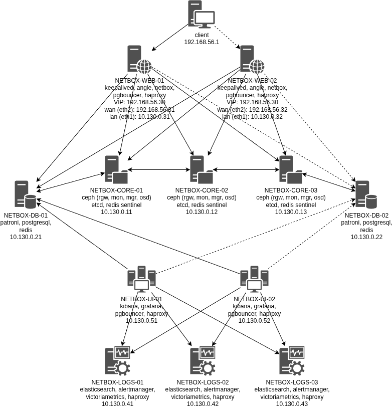

Все машины распределены на 5 групп: **core**, **db**, **web**, **logs**, **ui** и общаются между собой с использованием **Mutual TLS (mTLS)**. В каждой группе можно выключить одну любую виртуальную машину при этом сохранив работоспособность всех запущенных сервисов.

Группа **core** является сердцем кластера. Она содержит основные отказоустойчивые компоненты, такие как **ceph mon** (сердце кластер **ceph** на узлах **core**), **etcd** (сердце кластера **patroni** на узлах **db**), **redis sentinel** (сердце кластера **redis** на узлах **db**).

Группа **db** содержит кластер **postgresql** (на основе **patroni**) и кластер **redis**. Поскольку **etcd** и **redis sentinel** вынесены на отдельные узлы, то достаточно двух узлов (на кворум **etcd** и **redis sentinel** отказ одного из узлов в группе **db** не повлияет).

Группа **web** содержит **angie**, **netbox** и разделяет общий **VIP** адрес через **keepalived**. Для подключения к **primary** узлу **postgresql** в кластере **patroni** на эти узлы также установлен **haproxy**. **netbox** обращается в **haproxy** через локальный **pgbouncer**, таким образом смена **primary** проходит для **netbox** без разрыва соединения с базой данных (так как он подключён к **pgbouncer**, который делает это бесшовно). **haproxy** также является обратным прокси для **primary** сервера **redis** и обеспечивает **mTLS**. **angie** является обратным прокси для клиентов в **S3**, а **netbox** ходит в **S3** через **haproxy**.

Группа **logs** содержит сервисы мониторинга (**victoriametrics**), алертинга (**alertmanager**) и логирования (**elasticsearch**) в кластерном исполнении. Поскольку **victoriametrics** в бесплатной версии не поддерживает **mTLS**, то для этих целей (а также для целей аутентификации) рядом установлен **haproxy**, который берёт **mTLS** и аутентификацию на себя.

Группа **web** содержит **kibana** и **grafana**. Для того, чтобы **grafana** могла подключиться к  **primary** узлу **postgresql** в кластере **patroni** на эти узлы также установлен **haproxy** и **pgbouncer**.

В независимости от того, как созданы виртуальные машины, для их настройки запускается **Ansible Playbook** [provision.yml](provision.yml) который последовательно запускает следующие роли:

- **tls_ca** - создаёт сертификаты для корневых центров сертификации.
- **tls_certs** - создаёт сертификаты для узлов.
- **wait_for_connection** - ожидает доступность виртуальных машин.
- **apt_sources** - настраивает репозитории для пакетного менеджера **apt** (используется [mirror.yandex.ru](https://mirror.yandex.ru)).
- **apt_packages** - устанавливает пакеты с помощью **apt**.
- **apt_upgrade** - обновляет установленные пакет до последней версии.
- **ini_config** - обновляет конфигурационные файлы в INI формате.
- **unarchive** - скачивает и распаковывает релизные архивы с [github.com](https://github.com).
- **locale_gen** - генерит локаль **ru_RU.UTF-8** для последующего использования в **postgresql**.
- **user** - создаёт пользователей и группы.
- **file** - создаёт символически ссылки, директории и настраивает права для файлов.
- **lineinfile** - добавляет строчки в конфигурационные файл (обычно используется для редактирования `/root/.bashrc`).
- **config** - генерит конфигурационные файлы для всех сервисов.
- **haproxy** - настраивает **haproxy**.
- **elasticsearch** - настраивает кластер **elasticsearch**.
- **alertmanager** - настраивает кластер **alertmanager**.
- **victoriametrics** - настраивает кластер **victoriametrics** (**vmagent**, **vmalert**, **vmselect**, **vminsert**, **vmstorage**).
- **filebeat** - настраивает **filebeat** для сбора логов с узлов и отправки их в **elasticsearch**.
- **node_exporter** - настраивает **node_exporter**.
- **ceph** - устанавливает и настраивает **ceph**.
- **radosgw_admin** - создаёт пользователей для **S3** хранилища.
- **etcd** - настраивает кластер **etcd**.
- **patroni** - настраивает кластер **patroni**.
- **patroni_db** - настраивает базы данных в кластере **patroni**.
- **redis** - настраивает кластер **redis**.
- **redis_sentinel** - настраивает **redis sentinel** для переключения мастера в кластере **redis**.
- **pgbouncer** - настраивает **pgbouncer**.
- **s3_bucket** - создаёт корзины в **S3** хранилище.
- **netbox** - настраивает **netbox**.
- **angie** - настраивает **angie**.
- **kibana** - настраивает **kibana**.
- **grafana** - настраивает **grafana**.

Данные роли настраиваются с помощью переменных в директории [group_vars](group_vars), где они разбиты по ролям и группам серверов:

- [all](group_vars/all/) - общие настройки для всех серверов.
- [core](group_vars/core/) - настройки для **netbox-core-01**, **netbox-core-02**, **netbox-core-03**.
- [db](group_vars/db/) - настройки для **netbox-db-01**, **netbox-db-02**.
- [logs](group_vars/logs/) - настройки для **netbox-logs-01**, **netbox-logs-02**, **netbox-logs-03**.
- [ui](group_vars/ui/) - настройки для **netbox-ui-01**, **netbox-ui-02**.
- [web](group_vars/web/) - настройки для **netbox-web-01**, **netbox-web-02**.

Логин, пароли и сертификаты для подключения генерятся в директории [secrets](secrets). Файл [secrets](secrets/alertmanager_email.txt) с учётными данными для отправки алертов на почту должен быть создан вручную и имет следующее содержимое:

```text
smtp.yandex.ru:465
your_username@yandex.ru
your_16_character_app_password
```

Алерты для **vmalert** находятся в директории [alert](alerts).

Приборные панели для **grafana** находятся в директории [dashboards](dashboards).


## Запуск

### Запуск в Yandex Cloud

1. Необходимо установить и настроить утилиту **yc** по инструкции [Начало работы с интерфейсом командной строки](https://yandex.cloud/ru/docs/cli/quickstart).
2. Необходимо установить **Terraform** по инструкции [Начало работы с Terraform](https://yandex.cloud/ru/docs/tutorials/infrastructure-management/terraform-quickstart).
3. Необходимо установить **Ansible**.
4. Необходимо перейти в папку проекта и запустить скрипт [up.sh](up.sh).

### Запуск в Vagrant (VirtualBox)

Необходимо скачать **VagrantBox** для **bento/ubuntu-24.04** версии **202502.21.0** и добавить его в **Vagrant** под именем **bento/ubuntu-24.04/202502.21.0**. Сделать это можно командами:

```shell
curl -OL https://app.vagrantup.com/bento/boxes/ubuntu-24.04/versions/202502.21.0/providers/virtualbox/amd64/vagrant.box
vagrant box add vagrant.box --name "bento/ubuntu-24.04/202502.21.0"
rm vagrant.box
```

После этого нужно сделать **vagrant up** в папке проекта.

## Проверка

Протестировано в **OpenSUSE Tumbleweed**:

- **Vagrant 2.4.9**
- **VirtualBox 7.2.6_SUSE r172322**
- **Ansible 2.20.6**
- **Python 3.13.13**
- **Jinja2 3.1.6**

Проверку будет осуществлять для варианта разворачивания в **Vagrant** (c **keepalived**), поэтому прежде всего найдём узел, на котором настроен адрес **192.168.56.30**:

```text
❯ vagrant ssh netbox-web-01 -c 'ip address'
1: lo: <LOOPBACK,UP,LOWER_UP> mtu 65536 qdisc noqueue state UNKNOWN group default qlen 1000
    link/loopback 00:00:00:00:00:00 brd 00:00:00:00:00:00
    inet 127.0.0.1/8 scope host lo
       valid_lft forever preferred_lft forever
    inet6 ::1/128 scope host noprefixroute
       valid_lft forever preferred_lft forever
2: eth0: <BROADCAST,MULTICAST,UP,LOWER_UP> mtu 1500 qdisc fq_codel state UP group default qlen 1000
    link/ether 08:00:27:f8:c2:eb brd ff:ff:ff:ff:ff:ff
    altname enp0s3
    inet 10.0.2.15/24 metric 100 brd 10.0.2.255 scope global dynamic eth0
       valid_lft 86140sec preferred_lft 86140sec
    inet6 fd17:625c:f037:2:a00:27ff:fef8:c2eb/64 scope global dynamic mngtmpaddr noprefixroute
       valid_lft 86142sec preferred_lft 14142sec
    inet6 fe80::a00:27ff:fef8:c2eb/64 scope link
       valid_lft forever preferred_lft forever
3: eth1: <BROADCAST,MULTICAST,UP,LOWER_UP> mtu 1500 qdisc fq_codel state UP group default qlen 1000
    link/ether 08:00:27:54:1f:f6 brd ff:ff:ff:ff:ff:ff
    altname enp0s8
    inet 10.130.0.31/24 brd 10.130.0.255 scope global eth1
       valid_lft forever preferred_lft forever
    inet6 fe80::a00:27ff:fe54:1ff6/64 scope link
       valid_lft forever preferred_lft forever
4: eth2: <BROADCAST,MULTICAST,UP,LOWER_UP> mtu 1500 qdisc fq_codel state UP group default qlen 1000
    link/ether 08:00:27:6c:8e:21 brd ff:ff:ff:ff:ff:ff
    altname enp0s9
    inet 192.168.56.31/24 brd 192.168.56.255 scope global eth2
       valid_lft forever preferred_lft forever
    inet6 fe80::a00:27ff:fe6c:8e21/64 scope link
       valid_lft forever preferred_lft forever

❯ vagrant ssh netbox-web-02 -c 'ip address'
1: lo: <LOOPBACK,UP,LOWER_UP> mtu 65536 qdisc noqueue state UNKNOWN group default qlen 1000
    link/loopback 00:00:00:00:00:00 brd 00:00:00:00:00:00
    inet 127.0.0.1/8 scope host lo
       valid_lft forever preferred_lft forever
    inet6 ::1/128 scope host noprefixroute
       valid_lft forever preferred_lft forever
2: eth0: <BROADCAST,MULTICAST,UP,LOWER_UP> mtu 1500 qdisc fq_codel state UP group default qlen 1000
    link/ether 08:00:27:f8:c2:eb brd ff:ff:ff:ff:ff:ff
    altname enp0s3
    inet 10.0.2.15/24 metric 100 brd 10.0.2.255 scope global dynamic eth0
       valid_lft 86120sec preferred_lft 86120sec
    inet6 fd17:625c:f037:2:a00:27ff:fef8:c2eb/64 scope global dynamic mngtmpaddr noprefixroute
       valid_lft 86123sec preferred_lft 14123sec
    inet6 fe80::a00:27ff:fef8:c2eb/64 scope link
       valid_lft forever preferred_lft forever
3: eth1: <BROADCAST,MULTICAST,UP,LOWER_UP> mtu 1500 qdisc fq_codel state UP group default qlen 1000
    link/ether 08:00:27:2e:f4:dc brd ff:ff:ff:ff:ff:ff
    altname enp0s8
    inet 10.130.0.32/24 brd 10.130.0.255 scope global eth1
       valid_lft forever preferred_lft forever
    inet6 fe80::a00:27ff:fe2e:f4dc/64 scope link
       valid_lft forever preferred_lft forever
4: eth2: <BROADCAST,MULTICAST,UP,LOWER_UP> mtu 1500 qdisc fq_codel state UP group default qlen 1000
    link/ether 08:00:27:f5:bb:0e brd ff:ff:ff:ff:ff:ff
    altname enp0s9
    inet 192.168.56.32/24 brd 192.168.56.255 scope global eth2
       valid_lft forever preferred_lft forever
    inet 192.168.56.30/24 scope global secondary eth2
       valid_lft forever preferred_lft forever
    inet6 fe80::a00:27ff:fef5:bb0e/64 scope link
       valid_lft forever preferred_lft forever
```

Адрес настроен на **netbox-web-02**. Чтобы определить остальных мастеров откроем статистику **haproxy** на **netbox-web-01**, для этого пробросим порт 7000 через **ssh**:

```text
❯ vagrant ssh netbox-web-01 -- -L 127.0.0.1:7000:127.0.0.1:7000
```

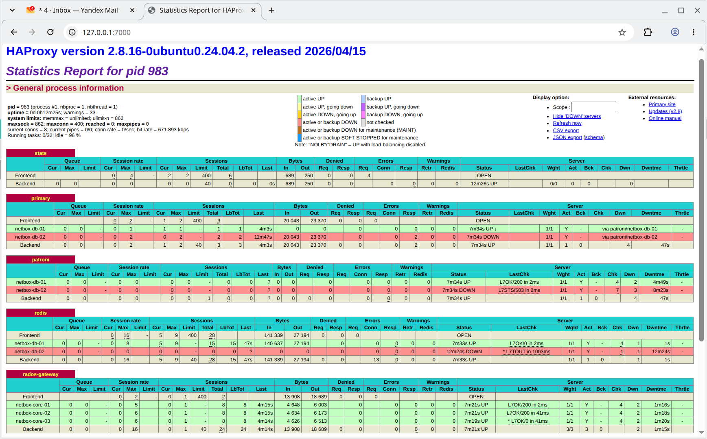

Откроем **netbox** по адресу [https://192.168.56.30](https://192.168.56.30) и проверим, что файлы в S3 читаются (**netbox** хранит в **S3** изображения устройств):

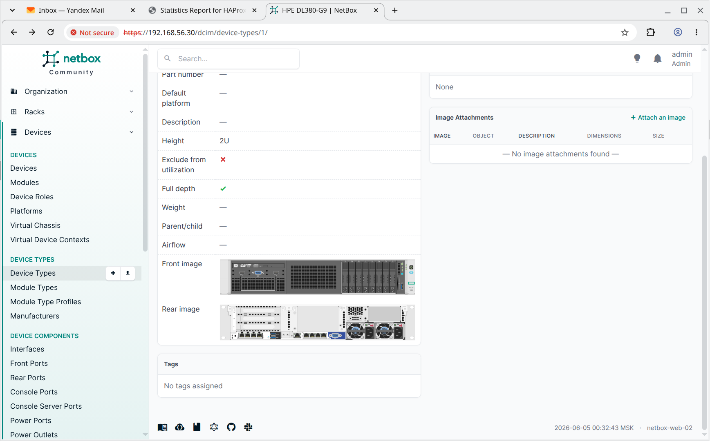

Загрузим пару скриптов **netbox** и выполним их:

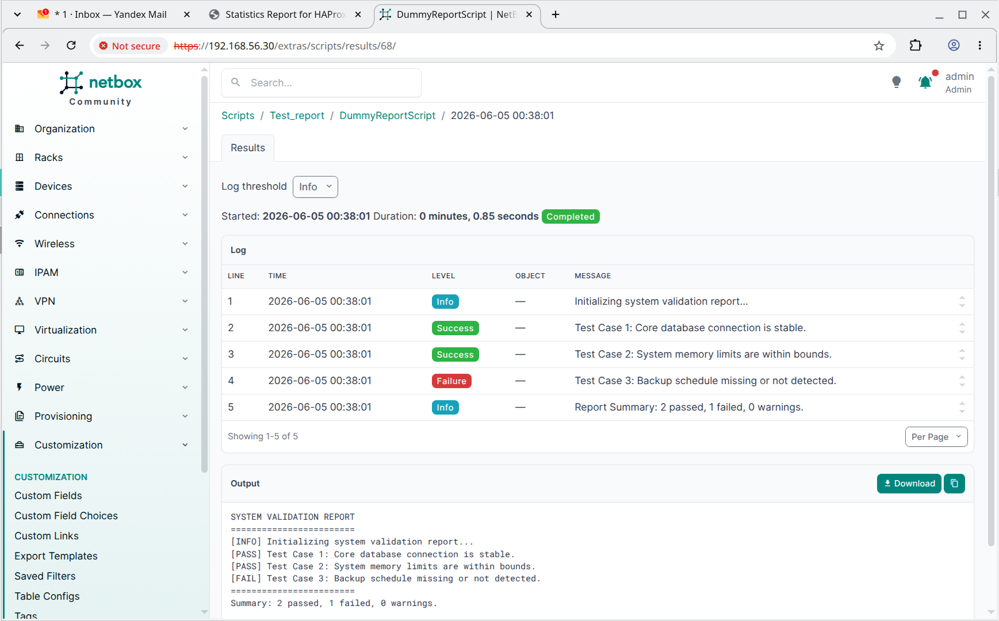

Из статистики **haproxy** видно, что мастером является **netbox-db-01**. мы также можем выключить по одной виртуальной машине в каждой группе. Выключим: **netbox-core-01**, **netbox-db-01** , **netbox-logs-02**, **netbox-ui-02**, **netbox-web-02**.

Видно, что **netbox-db-01** перестал быть доступен в **haproxy** (`L7STS/503` сменилось на `L7OK`, а другой узел стал `L4TOUT`):

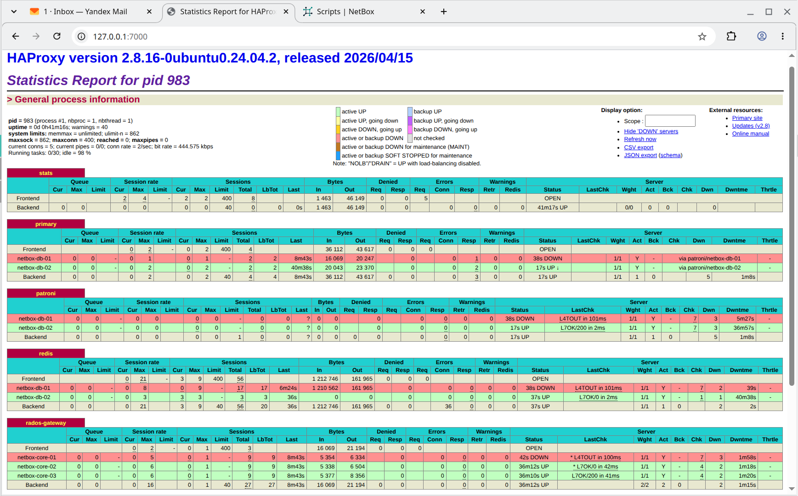

Проверим работу **netbox**, это не отразилось на его работе (как и на работе S3, где находятся картинки и скрипты). **IP** адрес `192.168.56.30` переехал на **netbox-web-01**, поэтому достаточно просто обновить страницу:

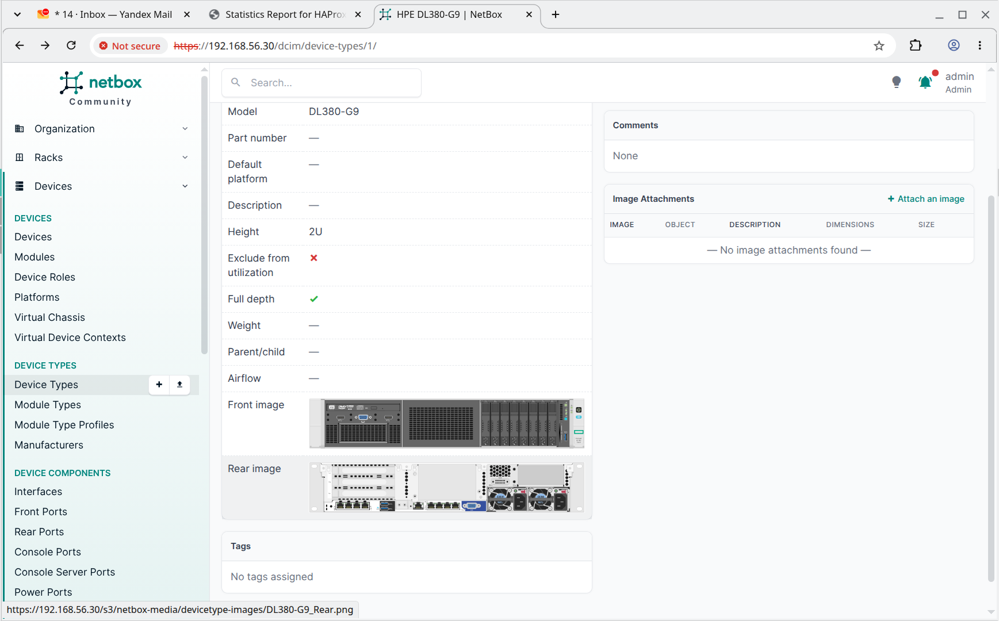

Проверим, что нам пришли алерты на отключение эти 5 узлов:

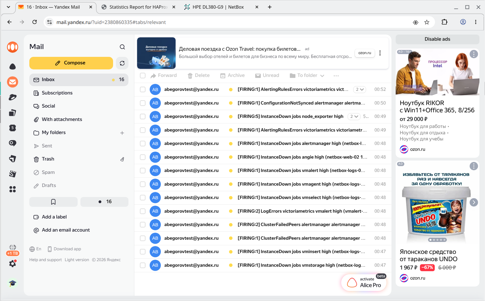

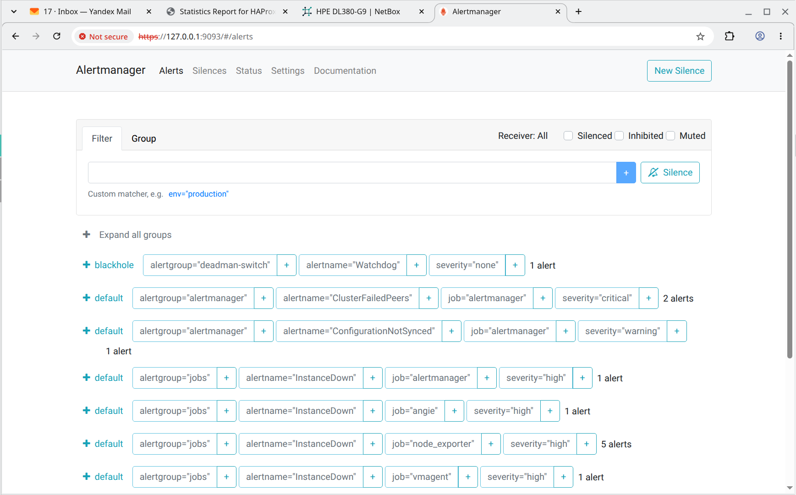

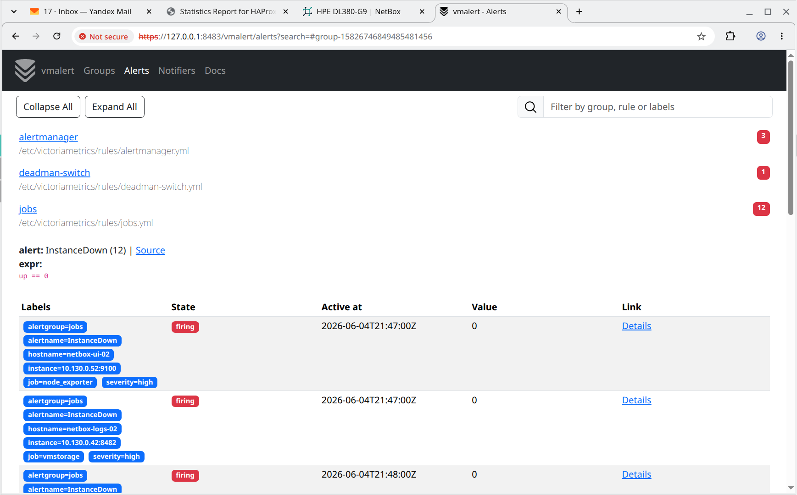

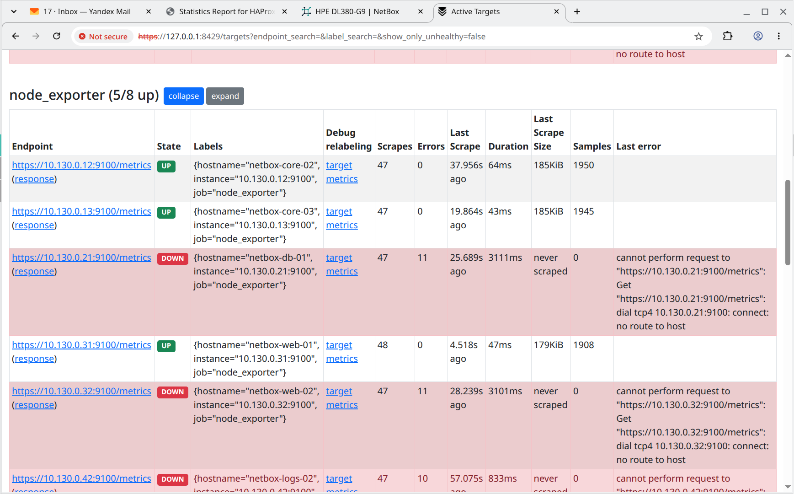

Проверим логи **elasticsearch** в **kibana**:

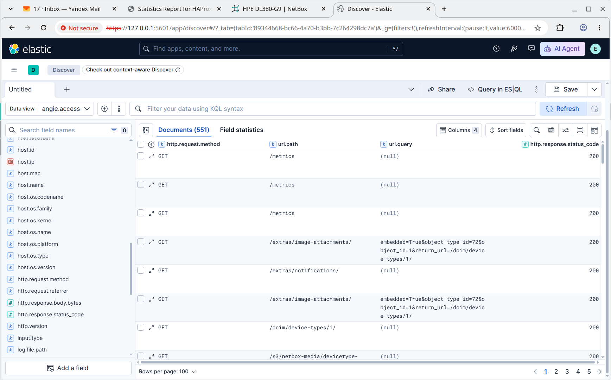

Проверим работу **grafana**:

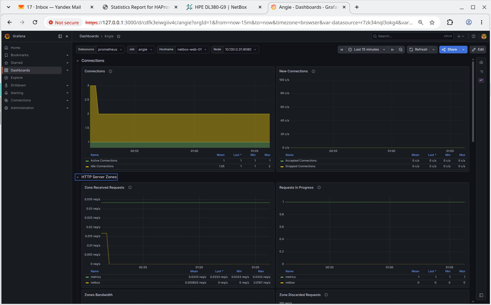

Проверим работу **ceph**:

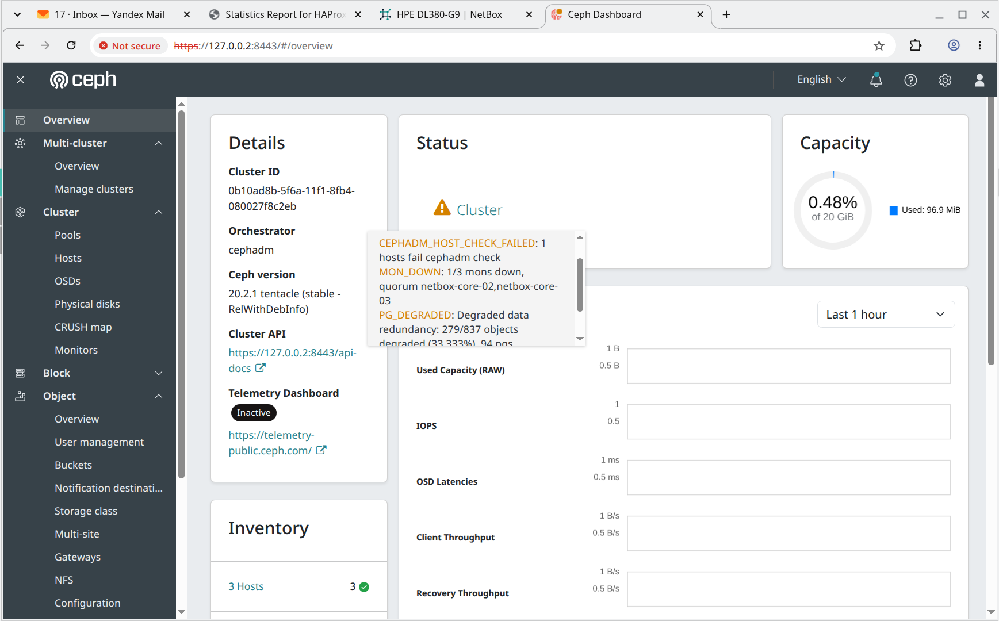

Как видно отключение этих 5 узлов не отразилось на работоспособности ни одного из запущенных сервисов.
